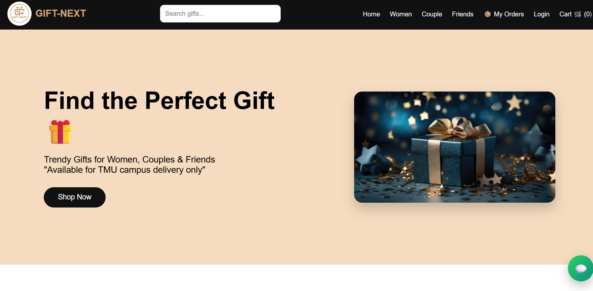
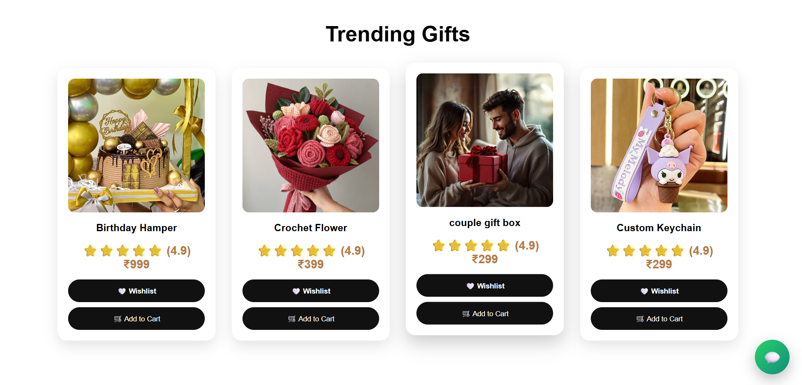
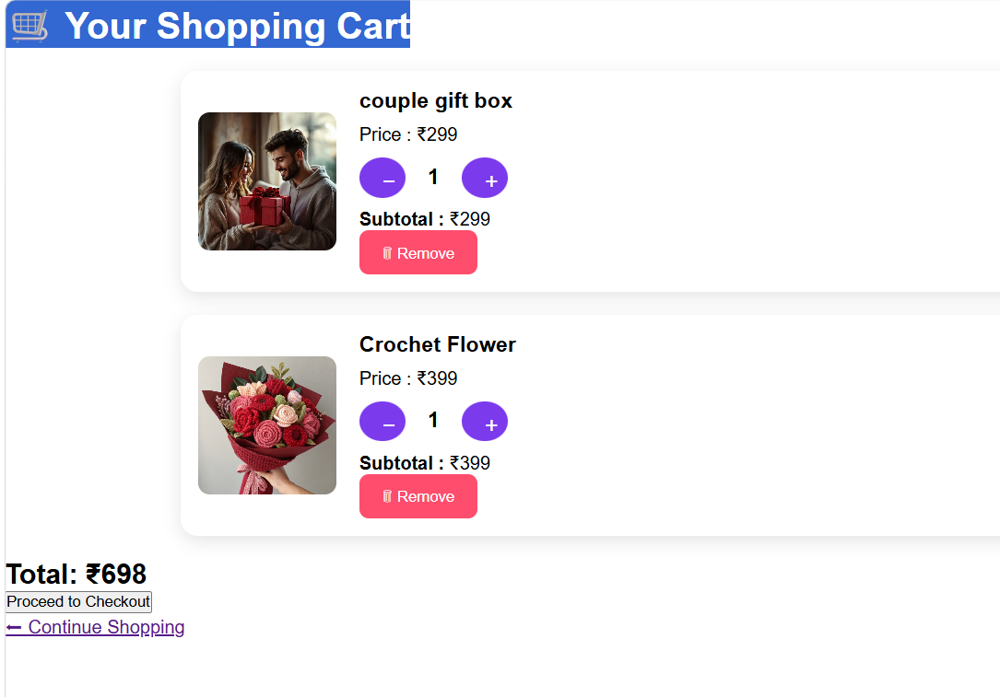
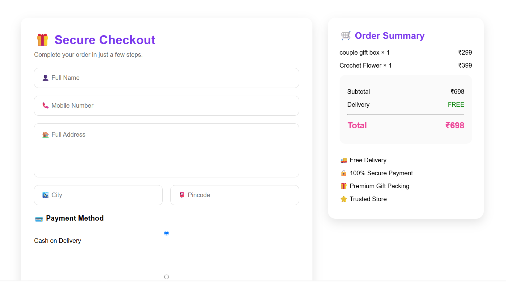
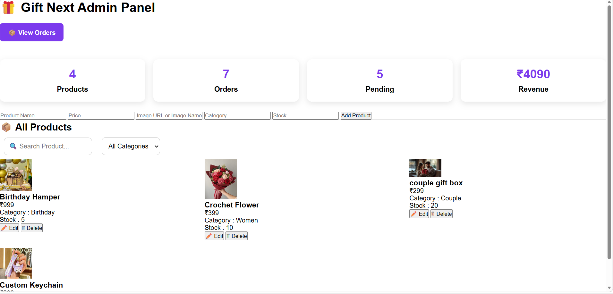

# Gift Next – E-commerce Website

## Overview
Gift Next is a responsive e-commerce website developed using HTML, CSS, JavaScript and Firebase.

## Features
- User Login & Authentication
- Product Listing
- Shopping Cart
- Checkout Page
- Order Management
- Admin Panel
- Firebase Integration
- Responsive Design

## Technologies Used
- HTML5
- CSS3
- JavaScript
- Firebase Authentication
- Firestore Database
- Git & GitHub

## Project Status
Currently under development with continuous feature improvements.
## 🌐 Live Demo

https://nj22112001-netizen.github.io/Gift-Next/

## Screenshots

### 🏠 Home Page

### 🛍️ Products Page

### 🛒 Cart Page

### 💳 Checkout Page

### 👨‍💼 Admin Panel

## Future Improvements

- Payment Gateway Integration
- Wishlist Feature
- Product Search & Filters
- Order Tracking
- Email Notifications

## Developer

**Nancy Jain**

GitHub: https://github.com/nj22112001-netizen
## Screenshots

### Home Page

### Products Page

### Cart Page

### Checkout Page

### Admin Panel

